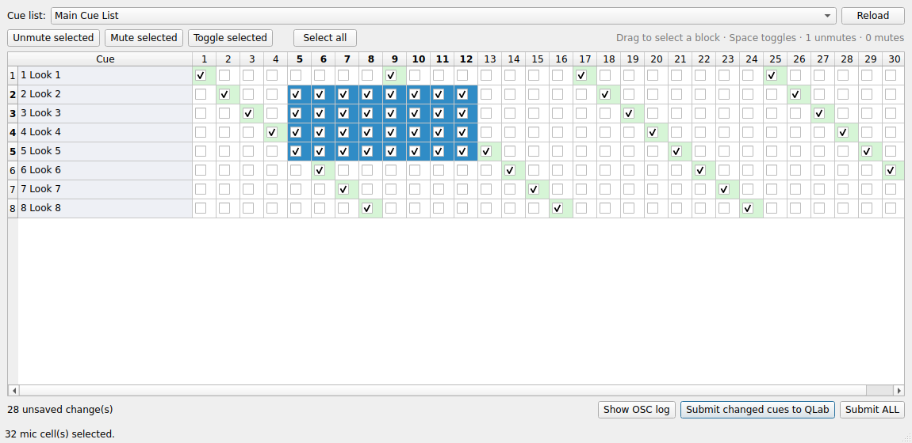

# QLab Flash

A Mac GUI app for **bulk-editing mic mute/unmute states across every cue** in a
QLab 5 workspace that drives a Behringer X32.

Instead of clicking mute checkboxes cue-by-cue, channel-by-channel, QLab Flash
shows your whole show as a spreadsheet: **cues down the side, mics 1–32 across
the top, a checkbox at every intersection.** Set them all, then hit **Submit** to
push every change to QLab at once over OSC.

> ☑ checked = mic **unmuted** (channel ON) ☐ unchecked = mic **muted** (channel OFF)



---

## Quick start

```bash
# 1. Try the interface immediately with a built-in simulated QLab — no QLab needed:
./run.sh --demo

# 2. When you're ready, connect to your real QLab:
./run.sh
```

The first launch creates a virtual environment and installs the GUI toolkit
(PySide6); after that it starts instantly. Requires **macOS** with Python 3
(the system `python3` on a modern Mac is fine, or install from python.org).

---

## How to use it

1. **Connect.** On launch you'll see open QLab workspaces. Pick one, enter the
   passcode if the workspace has one, and click **Connect**. (Tick *Demo mode*
   to explore against a fake show first.)
2. **Read.** QLab Flash reads the chosen cue list and builds the grid, showing
   the current mute state of every mic in every cue.
3. **Edit.** Click checkboxes, or select a block and set them in bulk (below).
4. **Submit.** Click **Submit changed cues to QLab**. Only the cues you actually
   changed are sent. *Submit ALL* rewrites every mic in every cue.

### Bulk selection (the time-saver)

- **Click-drag a rectangle** across the grid to select a block of cells —
  multiple cues × multiple mics at once.
- Shift-click / ⌘-click extend the selection like any spreadsheet.
- Then set them all in one move:
  - **Unmute selected** / **Mute selected** / **Toggle selected** buttons, or
  - right-click the selection for the same menu, or
  - the keyboard:

    | Key | Action |
    |-----|--------|
    | `Space` or `X` | Toggle selected mics |
    | `Enter` or `1` | Unmute selected (check) |
    | `0` or `Delete` | Mute selected (uncheck) |

- **Select all** selects the entire grid (e.g. mute everything, then open just
  the mics you need).

Edited-but-not-yet-submitted cells are tinted amber; live (unmuted) mics are
tinted green. The footer shows the unsaved-change count.

---

## Setting up QLab

QLab Flash talks to QLab over OSC on the standard port **53000**. In QLab:

1. Open **Workspace Settings → Network**.
2. Under **OSC Access**, allow access (and note the passcode if you set one).
   Make sure the access level permits editing cues, not just triggering them.

That's it — QLab Flash discovers the workspace automatically.

---

## How it maps to your cues (important)

QLab Flash assumes the common QLab→X32 structure:

- **Each row is a top-level cue** in the cue list — typically a **Group cue**
  for a given look/moment ("Cue 12 — Top of Act 2").
- **Each mic is a Network (OSC) cue** somewhere inside that group whose message
  tells the X32 to turn a channel on or off, e.g. `/ch/03/mix/on 1`.

QLab Flash scans each group for those per-channel messages, maps them onto the
32 mic columns, and on Submit writes the message back with the new on/off value.

**It updates existing per-channel cues; it does not create new ones.** If a cue
has no Network cue for, say, mic 7, that cell is shown dimmed and is skipped on
submit. (So your show needs one channel-on cue per mic per look — which is the
normal way this is built.)

If your wiring is different, **everything fragile is configurable** — see below
— so you can match QLab Flash to your show without touching code.

---

## Configuration

Defaults target QLab 5 + X32 with channel-on as the mute control. To override,
copy `config.example.json` to `~/.qlab-flash.json` (or pass `--config PATH`).
QLab Flash also saves your last host/port/passcode there automatically.

| Key | Default | Meaning |
|-----|---------|---------|
| `qlab_host` | `127.0.0.1` | QLab's IP (use the Mac's own IP if QLab is elsewhere). |
| `qlab_port` | `53000` | QLab's OSC receive port (don't change unless you must). |
| `mic_count` | `32` | Number of mic columns. |
| `osc_message_property` | `customString` | The QLab cue property holding a network cue's OSC text. If your QLab build reports it under another name, set it here. |
| `channel_pattern` | see file | Regex with named groups `chan` and `state` used to recognise a mic cue and read its channel + on/off value. |
| `write_template` | `/ch/{chan:02d}/mix/on {state}` | How a mic cue's message is written back. |
| `unmuted_value` / `muted_value` | `1` / `0` | OSC arg values meaning unmuted / muted. |

**Examples of adapting it:**

- Console uses a dedicated mute that's *inverted* (1 = muted): swap
  `unmuted_value` to `0`, `muted_value` to `1`, and point the pattern/template
  at your mute address.
- Your network cues address the X32 differently: edit `channel_pattern` and
  `write_template` to match.

The **Show OSC log** button (bottom bar) reveals exactly what QLab Flash sends
and receives — invaluable for confirming the addresses match your show.

---

## A note on verification

This was built and tested end-to-end against a **simulated QLab** (`--demo`
mode, also driven by the automated tests) because the developer didn't have a
live QLab+X32 rig to point it at. The OSC engine, cue parsing, grid editing, and
submit round-trip are all covered by tests. The one thing to sanity-check on
**your** real rig is that the cue-property name and OSC address patterns above
match your workspace — load a show, open the OSC log, and watch one Submit. If
the addresses look right, you're good. If not, tweak the config keys above.

Start by reading first and submitting a single changed mic on a throwaway cue to
confirm the round-trip before doing a whole show.

---

## Project layout

```
qlabflash/
  osc.py          # dependency-free OSC 1.0 encode/decode
  qlab.py         # QLab OSC-over-UDP client (discover, connect, read/write cues)
  model.py        # cue tree  <->  mic grid translation
  session.py      # connect -> load grid -> submit workflow
  config.py       # all tunable settings
  mock_qlab.py    # simulated QLab for demo mode and tests
  gui/            # PySide6 interface (spreadsheet, bulk select, connect dialog)
main.py           # entry point
tests/            # OSC, model, and full UDP round-trip tests
```

## Running the tests

```bash
pip install pytest
python3 -m pytest
```

The suite includes a real-socket round-trip: it spins up the mock QLab, connects,
reads the grid, flips a mic, submits, and re-reads to confirm the change landed.
